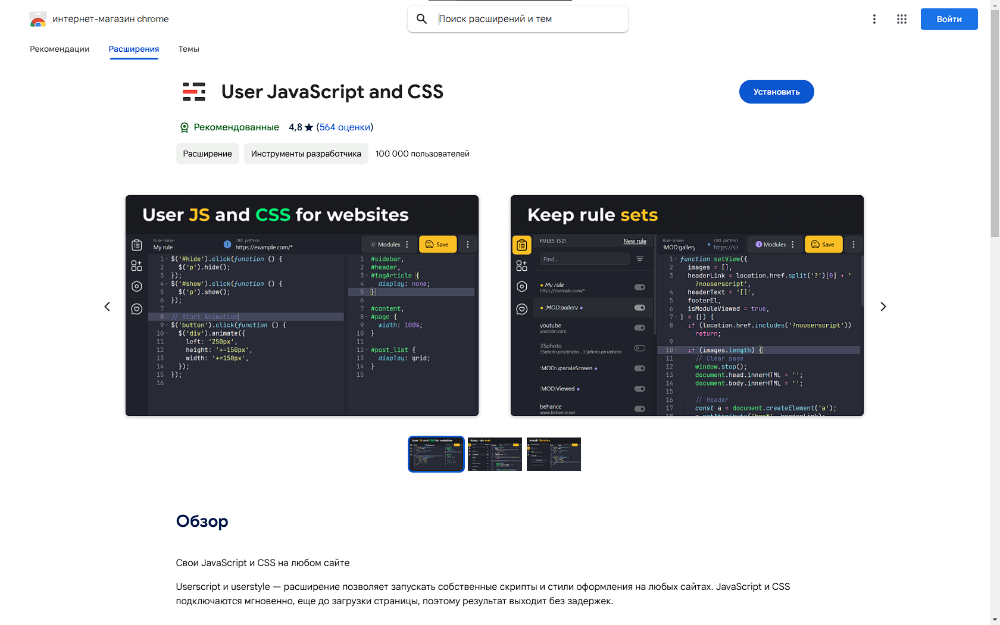

<h1>VKAutoLikes</h1>
<h4>Программа для автоматизации простановки реакций в ВК</h4>

<h2>Как установить
<h4>
    <ol>
        <li>Установить расширения <b style='color: yellow;'>User JavaScript and CSS</b> (или любое расширение, позволяющее встраивать скрипт) на браузер <i style='color: aqua;'>https://chromewebstore.google.com/detail/user-javascript-and-css/nbhcbdghjpllgmfilhnhkllmkecfmpld?hl=ru&utm_source=ext_sidebar</i>    </li>
        <li>Зайти в расширение    </li>
        <li>Добавить url паттерн <i style='color: aqua;'>https://vk.com/*</i>    </li>
        <li>Добавить в расширении модуль <b style='color: yellow;'>SweetAlert2</b> <i style='color: aqua;'>https://cdn.jsdelivr.net/npm/sweetalert2@11.14.5/dist/sweetalert2.min.js</i>    </li>
        <li>Скопировать код из <i style='color: aqua;'>script.js</i> и вставить в поле для JavaScript кода    </li>
        <li>Скопировать код из <i style='color: aqua;'>SweetAlert2.css</i> и вставить в поле для CSS кода    </li>
        <li>Сохранить правило    </li>
    </ol>
</h4>
<h2>
<h2>Как использовать
<h4>При нажатии <i style='color: orange;'>alt+l</i> появится окно с заголовком <b style='color: yellow;'>VKAutoLikes</b>, в нем введите число реакций которые нужно проставить  
</h4>
<h2>